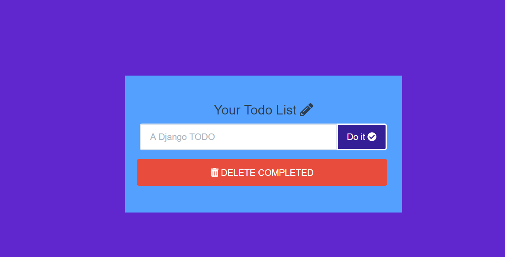
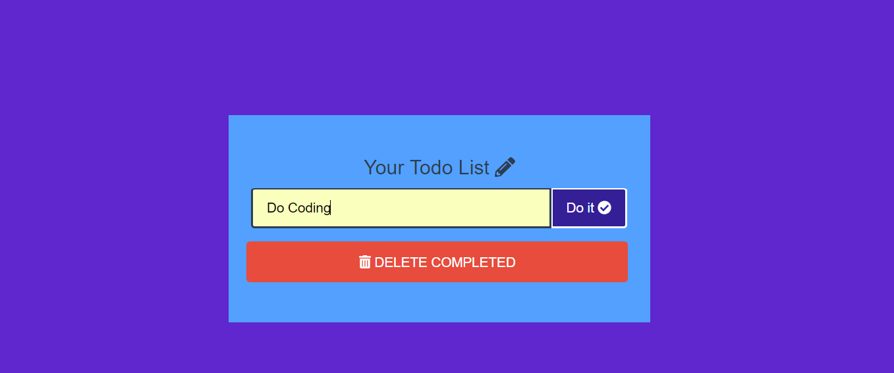
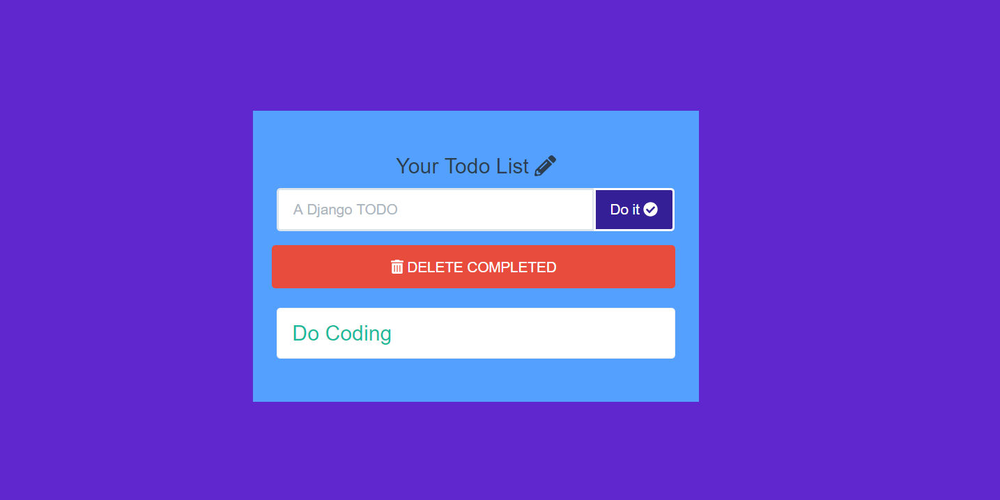
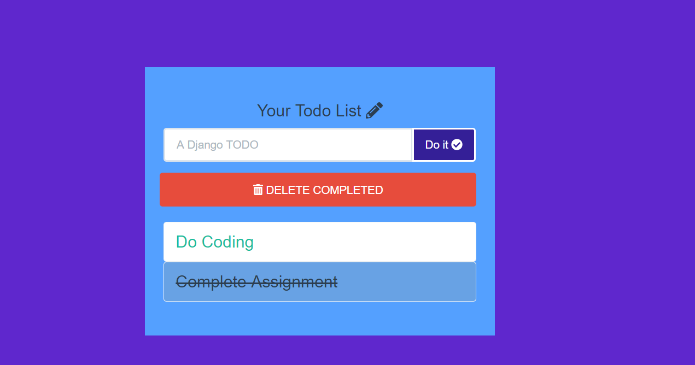

# Todo-List-App
Todo List App is a smart task list for everyday use.

## How To Use ?

- Write a task want to add in the list as shown in the image below. Suppose 'Do Coding' is the task to add, write it and Click on **Do It** button.

- The task will get added in the list as shown below.

- If the task is completed, Click on the the task and it will erase the the task from the list by a line through as shown in the image below.

- If you wish to completly delete the all the completed task from the list click on **DELETE COMPLETED** button. This will clear all the completed task from the list.

